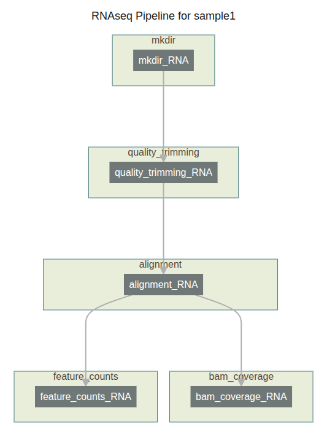

# RNAseq_SF
RNAseq pipeline using SnapFlow

Flow diagram of Pipeline:



Example usage:

```bash
python rna_seq_pipeline.py --sample sample1 -o results -p params.yaml > command.q

Use slurm_do.py (link) to schedule the jobs to Slurm

```bash
slurm_do.py -i command.q


